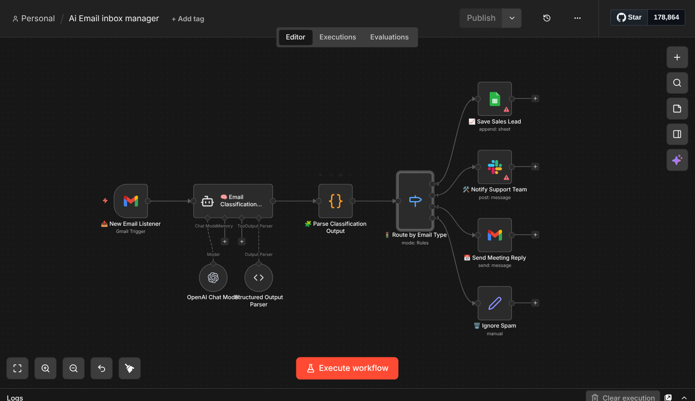

# AI Email Triage & Routing Automation (n8n)

This workflow automatically processes incoming emails and routes them to the correct department using AI classification.

---

## Workflow Overview

---

## Features

• AI email classification using OpenAI  
• Automated routing based on email intent  
• Sales lead capture in Google Sheets  
• Support team alerts via Slack  
• Automatic meeting replies  
• Spam filtering  

---

## Workflow Logic

New Email → AI Classification → Routing → Department Actions

Sales → Save lead to Google Sheets  
Support → Notify support team on Slack  
Meeting → Send automatic meeting reply  
Spam → Ignore or log

---

## Technologies Used

- n8n
- OpenAI
- Gmail API
- Slack
- Google Sheets

---

## Setup

1. Import the workflow JSON into n8n
2. Connect your credentials (Gmail, OpenAI, Slack, Google Sheets)
3. Activate the workflow

---

## Note

Credentials are not included in this repository.  
Please connect your own services when importing the workflow.
